### 👋 hi, I'm Diogo — welcome to my corner of GitHub

<code>Last login: Wed Aug 26 00:41:47 2026 from github.com</code>

  

  <a href="https://diogorodrigues.net">
    <picture>
      <source media="(prefers-color-scheme: dark)" srcset="https://readme-typing-svg.demolab.com?font=Fira+Code&weight=600&size=24&pause=1400&color=3FB950&center=true&vCenter=true&width=840&height=60&lines=open+source+%26+automation+enthusiast;1st+year+MSc+in+Computer+Science+%26+Engineering;Cybersecurity+Specialization+%40+Universidade+de+Coimbra;if+it+runs+on+Linux%2C+I+will+self-host+it;breaking+systems+to+understand+them" />
      
    </picture>
  </a>

  
  

---

## ⚙️ Featured builds

<table width="100%">
  <tr>
    <td>
      <h3>🍽️ <a href="https://github.com/diogor0d/plate-os">PlateOS</a></h3>
      

        
        
        
        
        
      

      
AI-powered nutrition tracking you run yourself — scan a barcode, snap the label, or tell the coach what you ate; nothing reaches the database until you confirm the proposal card. Offline-first PWA where the LLM extracts and deterministic code computes, hardened end-to-end: non-root containers, HMAC cookie auth, age-encrypted backups.

    </td>
  </tr>
  <tr>
    <td>
      <h3>💡 <a href="https://github.com/diogor0d/paper-spotlights">PaperSpotlights</a></h3>
      

        
        
        
        
        
      

      
Player-built stage lighting for Minecraft Paper — construct any fixture, aim it with an in-game lens, then dim it with a clock mounted in an item frame. Feels vanilla by design: invisible <code>LIGHT</code> blocks, dye-tinted particle washes, night-only automation, and zero NMS, reflection, or runtime dependencies.

    </td>
  </tr>
  <tr>
    <td>
      <h3>📼 <a href="https://github.com/diogor0d/metube-sidecar">metube-sidecar</a></h3>
      

        
        
        
        
        
      

      
Gives MeTube the automation API it never had — submit a URL, poll until complete, fetch the file straight into iOS Photos. Read-only mounts, path containment, and edge authentication through Cloudflare Access so the downloader stays private.

    </td>
  </tr>
  <tr>
    <td>
      <h3>🚉 <a href="https://github.com/diogor0d/codex-window-optimizator">Codex Window Runner</a></h3>
      

        
        
        
        
      

      
A station timetable for a fleet of Codex accounts — four scheduled sends a day keep every account aligned with its five-hour usage window, each isolated in its own persistent thread. The console is a signal box: live station clock, split-flap next-send module, and a departures board built from real run history.

    </td>
  </tr>
  <tr>
    <td>
      <h3>🤖 <a href="https://github.com/diogor0d/ciaac-bot">CIAAC Bot</a></h3>
      

        
        
        
        
      

      
Watches a public Instagram account and publishes every new post as a rich Discord embed — photos, carousels, and reels included. Slash commands handle custom embeds, birthdays at midnight, and the school calendar; swappable providers (Graph API polling or IFTTT push) behind a timing-safe webhook secret.

    </td>
  </tr>
  <tr>
    <td>
      <h3>💻 <a href="https://github.com/diogor0d/projetoSO">projetoSO</a> · <a href="https://github.com/diogor0d/projetorc">projetorc</a> · <a href="https://github.com/diogor0d/projetosd">projetosd</a> · <a href="https://github.com/diogor0d/projeto-poo">projeto-poo</a></h3>
      
C and Java systems coursework @ UC — operating systems, networks, distributed systems.

    </td>
  </tr>
</table>

---

## 🛠️ Toolkit

  <picture>
    <source media="(prefers-color-scheme: dark)" srcset="https://skillicons.dev/icons?i=c,cpp,python,java,ts,js,django,fastapi,react,postgres,linux,docker,bash,git,cloudflare,arduino&theme=dark&perline=8" />
    
  </picture>

---

## 🏆 Trophies & stats

<picture>
  <source media="(prefers-color-scheme: dark)" srcset="https://github-profile-trophy.vercel.app/?username=diogor0d&theme=radical&no-frame=true&no-bg=true&column=6&margin-w=6" />
  
</picture>

<table>
  <tr>
    <td>
      <picture>
        <source media="(prefers-color-scheme: dark)" srcset="https://github-readme-stats.vercel.app/api?username=diogor0d&show_icons=true&hide_border=true&bg_color=0D1117&title_color=3FB950&icon_color=4493F8&text_color=C9D1D9&ring_color=3FB950&include_all_commits=true&count_private=true" />
        
      </picture>
    </td>
    <td>
      <picture>
        <source media="(prefers-color-scheme: dark)" srcset="https://github-readme-stats.vercel.app/api/top-langs/?username=diogor0d&layout=compact&hide_border=true&bg_color=0D1117&title_color=3FB950&text_color=C9D1D9" />
        
      </picture>
    </td>
  </tr>
</table>

<picture>
  <source media="(prefers-color-scheme: dark)" srcset="https://streak-stats.demolab.com?user=diogor0d&hide_border=true&background=0D1117&border=0&currStreakNum=F0F6FC&currStreakLabel=3FB950&sideNums=F0F6FC&sideLabels=C9D1D9&dates=C9D1D9" />
  
</picture>

 

### 🐍 eating contributions since day one

<picture>
  <source media="(prefers-color-scheme: dark)" srcset="https://raw.githubusercontent.com/diogor0d/diogor0d/output/github-contribution-grid-snake-dark.svg" />
  
</picture>

---

  
  
  

